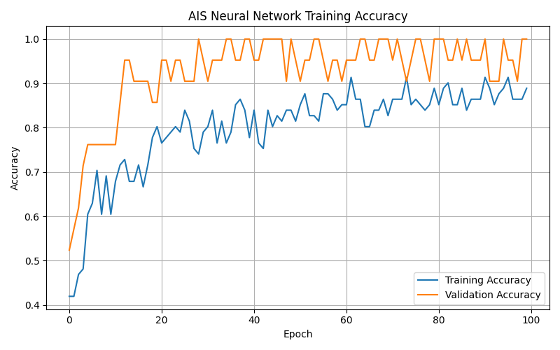

# 🌧️ Agricultural Rainfall Suitability Prediction System

## 🧠 Crop Planning using Rainfall Analytics, Bio-Inspired Optimization Algorithms and Machine Learning 

---

## 👤 Author

**Sagnik Patra**

---

## 📌 Project Overview

This project builds an end-to-end **Agricultural Rainfall Suitability Prediction System** using **bio-inspired optimization algorithms**, machine learning, and deep learning.

The system uses daily rainfall data from `DailyRainfallDataRaigadMaharashtra.csv`, performs rainfall-based feature engineering, applies feature selection using optimization algorithms such as **AIS**, **CSA**, and **PSO**, predicts crop suitability categories, generates crop planning recommendations, and automatically saves reports, graphs, prediction files, trained models, configuration files, and result summaries.

---



---

## 🎯 Objectives

- Analyze daily rainfall data of Raigad, Maharashtra
- Predict agricultural crop suitability using rainfall patterns
- Generate crop planning recommendations
- Apply bio-inspired feature selection algorithms
- Train machine learning and deep learning models
- Generate prediction CSV files
- Generate crop planning analytics CSV files
- Save trained models for future prediction
- Generate accuracy graphs, comparison graphs, and heatmaps
- Create a complete reproducible rainfall-based crop planning pipeline

---

## 📂 Dataset Used

```text
DailyRainfallDataRaigadMaharashtra.csv
